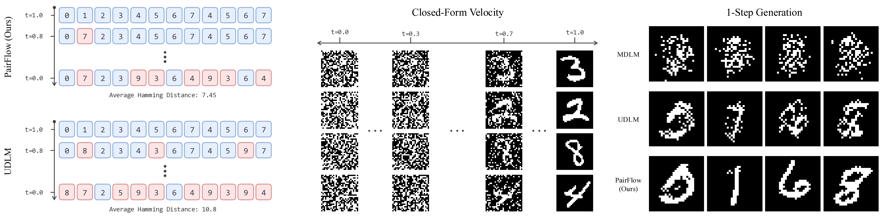

<div align="center">
<h2>PairFlow: Closed-Form Source-Target Coupling for Few-Step Generation in Discrete Flow Models</h2>

[Mingue Park*](https://uygnim99.github.io/) · [Jisung Hwang*]() · [Seungwoo Yoo*](https://dvelopery0115.github.io/) · [Kyeongmin Yeo](https://32v.github.io/) · [Minhyuk Sung](https://mhsung.github.io/)

(* Equal Contribution)

KAIST

<span style="font-size: 1.5em;"><b>ICLR 2026</b></span>

<a href="https://arxiv.org/abs/2512.20063"></a>
<a href='https://pair-flow.github.io'></a>



## TL;DR
<i><strong>PairFlow</strong> is a teacher-free acceleration framework for Discrete Flow Models that
builds source–target training pairs via a closed-form inversion/backward velocity, so the model
learns straighter, few-step paths. It’s cheap <span class="highlight-red">(≈0.2–1.7% of full
training compute)</span> yet improves
few-step sampling and can even strengthen the base model for later distillation.</i>

</div>


## Environment and Requirements

### Tested Environment
- **Python:** 3.12
- **CUDA:** 12.4
- **GPU:** Tested on NVIDIA RTX 3090 and RTX A6000

### Installation

```bash
conda create -n pairflow python=3.12
conda activate pairflow
conda install nvidia/label/cuda-12.4.0::cuda-toolkit
pip install -r requirements.txt
pip install flash_attn==2.7.4.post1
pip install rdkit pytorch_image_generation_metrics pillow

# Install local CUDA extension
cd df_cuda
pip install -e .
cd ..
```

# Dataset Download and Pre-processing

In the commands below, `<DATASET>` is one of: `qm9`, `zinc-250k`, `mnist-binary`, `cifar-10`.

### 1. Dataset Download & Parsing
This script downloads the dataset and parses it into tokenized sequences.
```bash
cd data/preprocessed/<DATASET>
python download_dataset.py
```

### 2. Pairing with Closed-Form Backward Velocity
We provide the pairing script using Closed-Form Backward Velocity (Alg. 1 in the paper).
```bash
cd data/preprocessed
python pairflow_preprocess.py --dataset_type=<DATASET> --batch_size=<BATCH_SIZE>
# We recommend using the full VRAM of your GPU for faster generation.
# This script supports multi-GPU parallel generation.

# You can also customize the step size and tau (default=1.0).
# python pairflow_preprocess.py --dataset_type=<DATASET> \
#   --batch_size=<BATCH_SIZE> --num_steps=<NUM_STEPS> --tau=<TAU>
```

# Training
<a name="training"></a>
Training scripts are provided at `scripts/train/<DATASET>/<MODEL>.sh`, where `<MODEL>` is one of `mdlm`, `udlm`, `pairflow`. Run them from the project root:

```bash
bash scripts/train/<DATASET>/<MODEL>.sh
```

> **Note.** Training writes checkpoints to the Hydra output directory (under `outputs/`). Before running distillation or evaluation, you must place the trained checkpoint at the path expected by each script — `checkpoints/<DATASET>/<MODEL>.ckpt` (e.g., `checkpoints/qm9/pairflow.ckpt`). The DCD/ReDi/eval scripts will not find the model otherwise.


# Distillation
<a name="distillation"></a>

We provide two distillation methods: [Discrete Consistency Distillation (DCD)](https://arxiv.org/abs/2506.10892) and [Rectified Discrete Flow (ReDi)](https://arxiv.org/abs/2507.15897). Each method requires a short preparation step before running. For both methods, `<MODEL>` is one of `udlm`, `pairflow`.

### 1. DCD
First, generate the pre-computed integral for each dataset. Please refer to the [DUO codebase](https://github.com/s-sahoo/duo) and follow its instructions. The DCD trainer resolves the cache path as `integral/${tokenizer_name_or_path}.pkl`, so place the generated file at one of the following paths (matching the `tokenizer_name_or_path` field in `configs/data/<DATASET>.yaml`):

| Dataset | Integral file path |
|---|---|
| `mnist-binary` | `integral/binary_pixels.pkl` |
| `cifar-10` | `integral/raw_pixels.pkl` |
| `qm9` | `integral/yairschiff/qm9-tokenizer.pkl` |
| `zinc-250k` | `integral/yairschiff/zinc250k-tokenizer.pkl` |

Then run:

```bash
# DCD
bash scripts/dcd/<DATASET>/<MODEL>.sh
```

### 2. ReDi
First, generate the source–target pairs using a pre-trained model with the script below. Place your checkpoint at the expected path (`checkpoints/<DATASET>/<MODEL>.ckpt`) and run the script. It will automatically generate the pairs and save them to `data/redi/<DATASET>/<MODEL>/`, which the ReDi script reads from in the next step.

```bash
# Generate pairs (writes to data/redi/<DATASET>/<MODEL>/)
bash scripts/generate-pair/<DATASET>/<MODEL>.sh
# You can override the sampling steps, total samples, sampling type, and predictor.
bash scripts/generate-pair/<DATASET>/<MODEL>.sh \
  --SAMPLING_STEPS=<SAMPLING_STEPS> --TOTAL_SAMPLES=<TOTAL_SAMPLES> \
  --SAMPLING_TYPE=<SAMPLING_TYPE> --PREDICTOR=<PREDICTOR>
# ReDi (reads from data/redi/<DATASET>/<MODEL>/)
bash scripts/redi/<DATASET>/<MODEL>.sh
```


# Sampling & Eval
<a name="sampling"></a>
We also provide evaluation scripts for each dataset. These scripts automatically generate samples and compute the metrics.

### FID Reference Stats (image datasets only)
For image datasets (`cifar-10`, `mnist-binary`), FID is computed against a reference statistics file loaded from `./fid_features/<DATASET>.npz`. This file is **not included in the repository** — you must generate it yourself from the real training images before running evaluation. We use [`pytorch_image_generation_metrics`](https://github.com/w86763777/pytorch-image-generation-metrics) for the computation; please follow its documentation to precompute the Inception statistics and save them to:

| Dataset | Reference stats path |
|---|---|
| `cifar-10` | `fid_features/cifar-10.npz` |
| `mnist-binary` | `fid_features/mnist-binary.npz` |

QM9 and ZINC-250k use SMILES-based molecular metrics (validity / uniqueness / novelty) and do not require this file.

### Running Evaluation

```bash
bash scripts/eval/<DATASET>/<MODEL>.sh \
  --SAMPLING_STEPS=<SAMPLING_STEPS> --TOTAL_SAMPLES=<TOTAL_SAMPLES> \
  --SAMPLING_TYPE=<SAMPLING_TYPE>
# For QM9 and ZINC-250k, you can additionally pass --NUM_TRIALS to average over multiple sampling trials:
bash scripts/eval/{qm9, zinc-250k}/<MODEL>.sh \
  --SAMPLING_STEPS=<SAMPLING_STEPS> --TOTAL_SAMPLES=<TOTAL_SAMPLES> \
  --SAMPLING_TYPE=<SAMPLING_TYPE> --NUM_TRIALS=<NUM_TRIALS>
```

Generated samples and metrics are written to `./evaluation/<DATASET>/<MODEL>-<SAMPLING_TYPE>/num_steps-<SAMPLING_STEPS>_total-<TOTAL_SAMPLES>/`.

Here, `<MODEL>` is one of:
- `mdlm` — MDLM baseline
- `udlm` — UDLM baseline
- `pairflow` — PairFlow (ours)
- `udlm+dcd`, `pairflow+dcd` — after DCD distillation
- `udlm+redi`, `pairflow+redi` — after ReDi distillation

# Acknowledgements & Citation
This repository is built on top of the [DUO codebase](https://github.com/s-sahoo/duo). If you find our work useful, please cite:
```
@article{park2025pairflow,
  title={PairFlow: Closed-Form Source-Target Coupling for Few-Step Generation in Discrete Flow Models},
  author={Park, Mingue and Hwang, Jisung and Yoo, Seungwoo and Yeo, Kyeongmin and Sung, Minhyuk},
  journal={arXiv preprint arXiv:2512.20063},
  year={2025}
}
```
